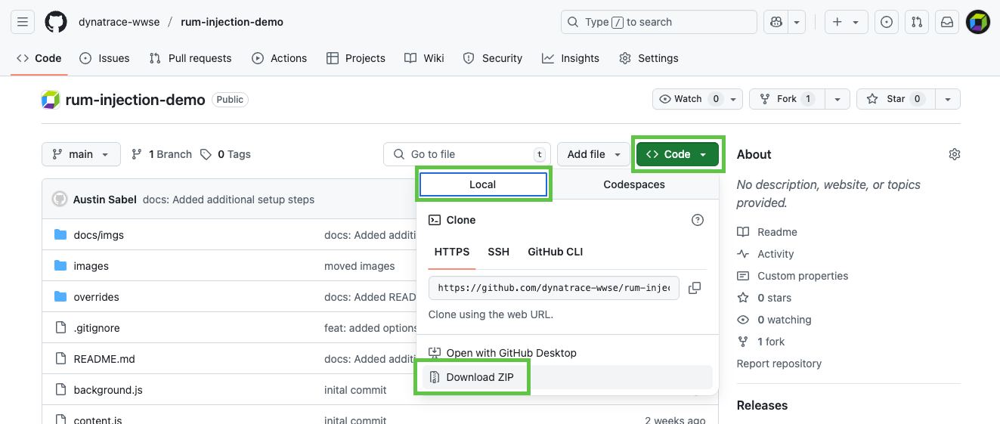
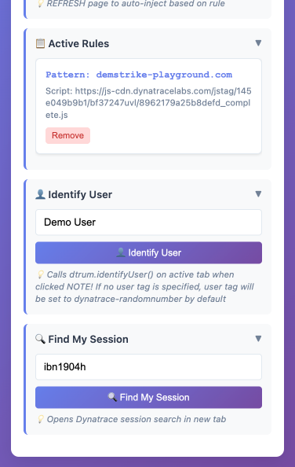

# Dynatrace SE RUM Injection Demo

## Download and Install Extension

1. Open Chrome and navigate to [https://github.com/dynatrace-wwse/rum-injection-demo](https://github.com/dynatrace-wwse/rum-injection-demo), click the `Code` button, then `Download ZIP`

2. Open your download folder and unzip `rum-injection-demo-main.zip`

3. In Chrome, select `menu "𐄛"  > Extensions > Manage Extensions`

4. Enable Developer Mode in the top right

5. Click `Load Unpacked`

6. Nagivated to the unzipped directory from step #2 and click `Select`

## Setting Up Web Application in Dynatrace

1. Navigate to the hub and search for "Web application monitoring via manual insertion" and click “Set up”  

2. Type in the domain of the website you want to monitor and click "add web application"  

3. Copy the src url, you’ll enter this into the extension   

4. Click `View Application` this brings you to the application screen  

5. Check the 3 dots and select edit  

6. Under General Settings, navigate to "enablement and cost control", toggle on "Enable New Real User Monitoring Experience" and "Enable Session Replay Classic" and click "Save Changes"  

## Configure Extension for Demo

1. Navigate to `Web Application Injection Setup` settings page in Dynatrace, and copy the src value from the javaScript tag snippet

2. Click the `Extension` icon   in toolbar, then Click `Dynatrace RUM Injector` extension.

3. Enter the domain of the site you wish to demo on, then paste your javascript src url from step #1, and hit `Save`

4. Refresh the page to begin injection of the RUM tag.

5. Now click around on the site to verify the beacons are being sent and check in Dynatrace to validate data is coming in. If you're not seeing beacons with HTTP status 200, try opening the website in a new tab or window and validate the following: 1. The Dynatrace RUM JavaScript tag is injected on the page, in the `<header>` of the html 2. There aren't any CSP errors in the Console 3. The URL pattern and source URL are correct in the extension configuration 

> The RUM Injector Extension UI now provides the ability to identify your user (add a user tag) within the extension itself, as well as the ability to find your session in the tenant.

> (Alternatively, use `dtrum.identifyUser('user-name')`)

> Normally, **RUM** sessions end on of the ways documented here: [https://docs.dynatrace.com/docs/shortlink/user-session#user-session-end]()
> However, we want to be able to create a bunch of sessions quickly without having to close the browser or wait for inactivity. To do this, navigate to the console in Chrome Dev Tools and type `dtrum.endSession()` and hit enter 
