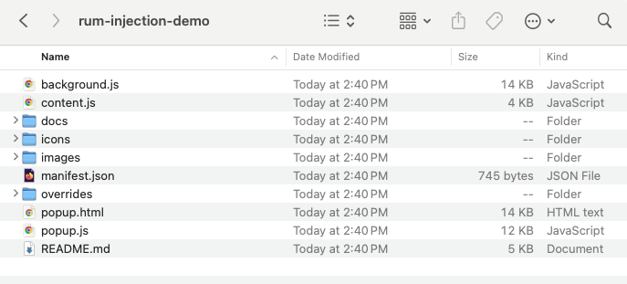

# Dynatrace SE RUM Injection Demo

## Download and Install Extension

1. Open Chrome and navigate to [https://github.com/dynatrace-wwse/rum-injection-demo](https://github.com/dynatrace-wwse/rum-injection-demo), click the `Code` button, then `Download ZIP`

2. Open your download folder and unzip `rum-injection-demo-main.zip`

3. In Chrome, select `menu "𐄛"  > Extensions > Manage Extensions`

4. Enable Developer Mode in the top right

5. Click `Load Unpacked`

6. Nagivated to the unzipped directory from step #2 and click `Select`

## Setting Up Web Application in Dynatrace

1. Navigate to the hub and search for "Web application monitoring via manual insertion" and click “Set up” 

2. Type in the domain of the website you want to monitor and click "add web application"  

3. Copy the src url, you’ll enter this into the extension   

4. Click `View Application` this brings you to the application screen  

5. Check the 3 dots and select edit  

6. Under General Settings, navigate to "enablement and cost control", toggle on "Enable New Real User Monitoring Experience" and "Enable Session Replay Classic" and click "Save Changes"  

## Configure Extension for Demo

1. Navigate to `Web Application Injection Setup` settings page in Dynatrace, and copy the src value from the javaScript tag snippet

2. Click the `Extension` icon   in toolbar, then Click `Dynatrace RUM Injector` extension.

3. Enter the domain of the site you wish to demo on, then paste your javascript src url from step #1, and hit `Save`

##  Content Security Policy Warnings

You may encounter sites that restrict remote content loading and request using the [Content Security Policy (CSP)](https://developer.mozilla.org/en-US/docs/Web/HTTP/Guides/CSP). 

>Content Security Policy (CSP) is a feature that helps to prevent or minimize the risk of certain types of security threats. It consists of a series of instructions from a website to a browser, which instruct the browser to place restrictions on the things that the code comprising the site is allowed to do.
> The primary use case for CSP is to control which resources, in particular JavaScript resources, a document is allowed to load. This is mainly used as a defense against [cross-site scripting (XSS)](https://developer.mozilla.org/en-US/docs/Glossary/Cross-site_scripting) attacks, in which an attacker is able to inject malicious code into the victim's site.

Since we are injecting our RUM locally via an extension, you may see these warnings in your DevTool Console, for example:

### Temporarily Override Content-Security-Policy using DevTools

1. Navigate to the site you plan to demo on, and was configured in your extension settings

2. Open the Developer Tools `View > Developer > Developer Tools`

3. Switch to the `Sources` tab, then `Overrides` sub-tab. 

4. Click `Select folder for overrides`

5. Navigate to `overrides` directory in you unzipped extension folder and press `Select`

6. Refresh the page and you should no any CSP warning, and the RUM extension and beacon calls should now be seen in the network tab

> ⚠️ **Warning these overrides only function while the DevTool window is open.  Be sure to leave the DevTool open for the entire time you are running your demo** ⚠️

> Normally, **RUM** sessions end on of the ways documented here: [https://docs.dynatrace.com/docs/shortlink/user-session#user-session-end]()
>
> However, we want to be able to create a bunch of sessions quickly without having to close the browser or wait for inactivity. To do this, navigate to the console in Chrome Dev Tools and type `dtrum.endSession()` and hit enter 
